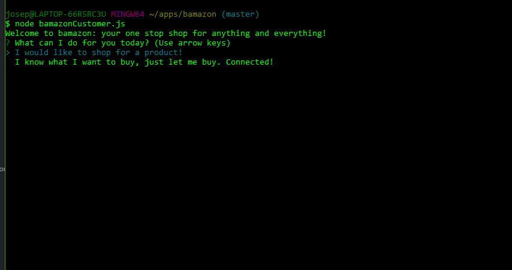
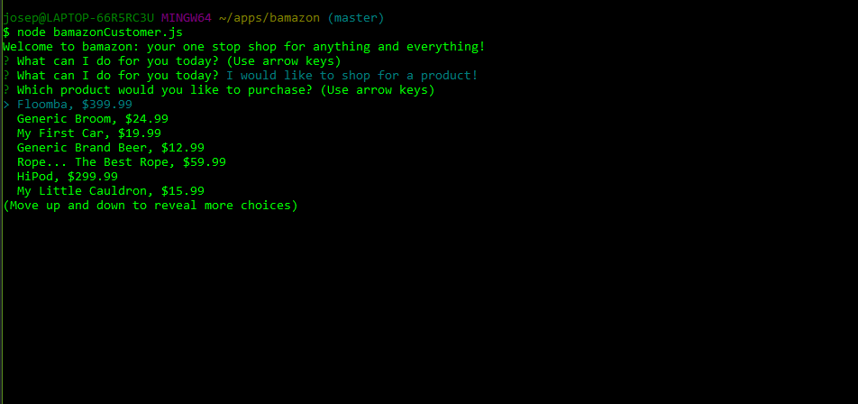
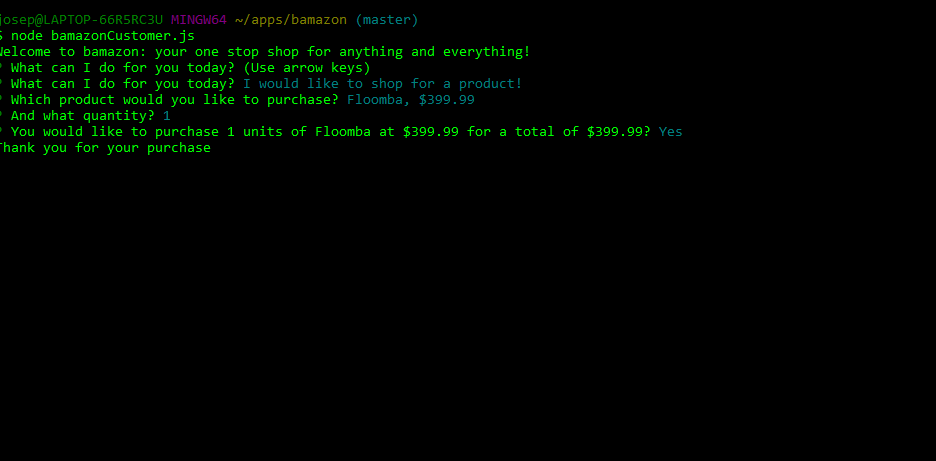
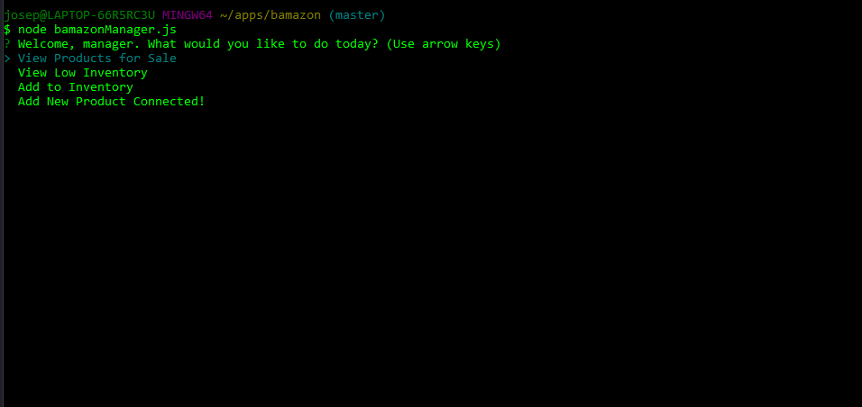
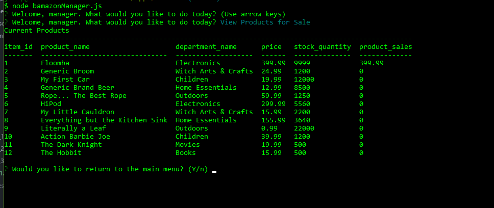
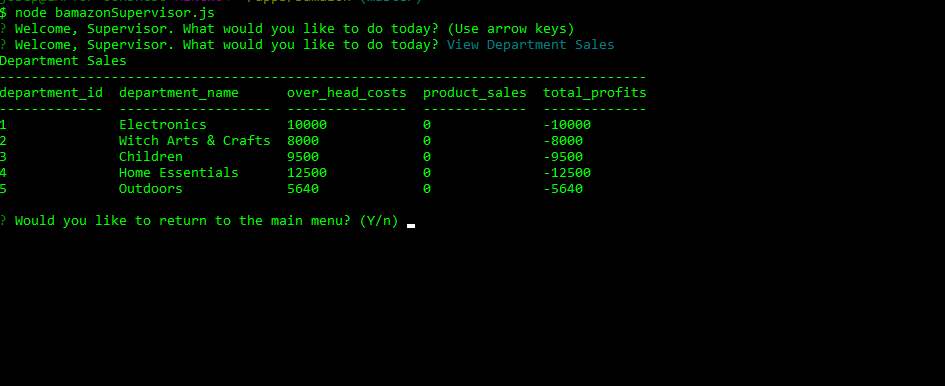

# bamazon

bamazon is a useful online shopping CLI application. The three interations: bamazonCustomer.js, bamazonManager.js, and bamazonSupervisor.js each provide the user with a different interactive experience depending on their seniority level.

## Dependencies
bamazon requires the following npm:
- [inquirer](https://www.npmjs.com/package/inquirer)
- [mysql](https://www.npmjs.com/package/mysql)
- [console.table](https://www.npmjs.com/package/console.table)

All of which are documented in the package.json and as such, can be installed locally using ```npm install ```.

Additionally, the application uses a MySQL server and the scheme for the server as well as the data can be found in ```bamazon_db.sql```.

## bamazonCustomer.js
bamazonCustomer.js is the customer facing interface for the online marketplace. Initially, the user is presented with a simple GUI:


### Option 1
Selecting **Option 1** brings up a list for the user to navigate through with each product and the price per unit of that project on it's own line.



Selecting any of those options brings up another field for the user to enter a quantity to purchase. Then, the user is prompted to confirm the purchase and is thanked for their business.



### Option 2
The second option allows the user to enter an item's unique ```item_id``` as well as a quantity to purchase. Upon entering both those values, the application returns a total and confirmation dialogue for the user.

## bamazonManager.js
On load, the manager is given a set of administrative tools to manipulate the database.



### View Products
The view products tab brings up a table of current products for sale as well as the current inventories. As with every menu at the manager level, the user is prompted to return to the main menu if they wish.



### View Low Inventory
The view low inventory tab works the same as the view products tab, but only returns results if there are any products with inventories below 100 units.

### Add to Inventory | Add New Product
These two tabs function in a similar way. They add to inventoy tab prompts the user to enter the item ID and quantity to add as text fields. Similarly, the Add New Product tab allows the user to enter all the details for a new product as text prompts which are then added to the database.

## bamazonSupervisor.js
The final tier of bamazon is the supervisor level. Here, the user can view department sales and add new departments to the database.

### View Department sales
The view department sales tab returns a table of sales by department as well as the over head costs of each department. The total profit column is dynamically generated based on the database contents.



### Add New Department
Just as with the manager tabs, the add new department tab on the supervisor page prompts the user to fill in text fields to populate a new department in the database. 
